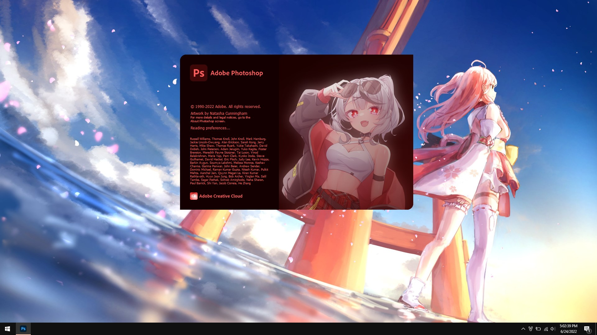
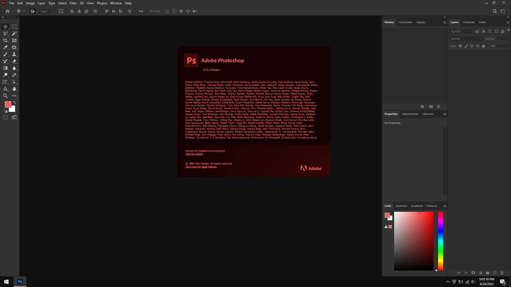

# Sakamata Chloe Photoshop Theme
This is a Photoshop "theme" I "worked" on, to ditch out of the ~~"boring"~~ default interface. Hope you enjoy! (I never steal arts, credits given below).  
If the author of the artwork below has any issues with this work, please contact me immediately on email npl@duck.com or Discord s1s#7826.
Thanks!

## Image sources
Artwork: https://www.pixiv.net/en/artworks/98963481

## How to install?
1. Make sure you have made a backup before install.
2. Download "Theme.zip" from [Releases](https://github.com/s1stine/photoshop/releases).
3. Extract to your Photoshop installation folder, mainly:
`C:\Program Files\Adobe\Adobe Photoshop <version>`
4. If you have made a backup, overwrite the existing ones.

## Source code?
Source PSD and PNG is available above.

## Screenshots
### Splash screen

### About box

